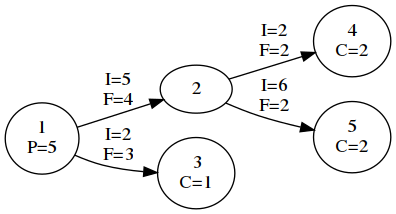
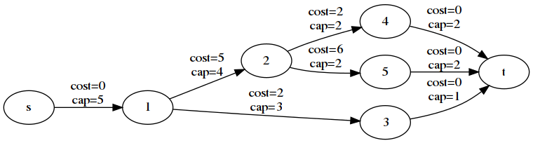

# Traffic Lights A [algo]

- Score: 486
- Solves: 30

## Problem

See [Traffic_Lights_A.pdf](Traffic_Lights_A.pdf).

## Solution

This problem can be reduced to minimum-cost flow problem by a typical conversion.

Sample 1:




This sample is converted as follows:



This conversion is as follows:

- Each I is regarded as the cost of the edge.
- Each F is regarded as the capacity of the edge.
- Node s and t are added.
- Edges from s to nodes whose value P exists are added where the cost is 0 and the capacity is P of the ending node.
- Edges from nodes whose value C exists to t are added where the cost is 0 and the capacity is C of the starting node.

Then, this is minimum-cost flow problem from s to t where the flow is ΣC (= 1+2+2). Various algorithms are known for solving this problem, e.g. primal-dual algorithm and network simplex algorithm. To cut corners in implementation, I used [NetworkX](https://networkx.github.io/).

- Source code: [solver.py](solver.py)

```fish
$ python solver.py
Welcome! Good luck :D
You have 120 seconds to solve all ten cases
Here's case 1!
5 4 1 3
1 2 5 4
1 3 2 3
2 4 2 2
2 5 6 2
1 6
3 1
4 2
5 2

> 38
Congrats, that's right!
Here's case 2!
10 19 1 1
6 2 14809 170
... snip ...
941 451
914 132
873 441

> 531445736
Congrats, that's right!
Wow, you really know your flow!
Take this flag and get the heck out.
flag{n0_u_c4n7_ju57_u53_n37w0rk_51mpl3x_h4h4_c4r_60_vr00m_69bb3a80}
```

## Flag

`flag{n0_u_c4n7_ju57_u53_n37w0rk_51mpl3x_h4h4_c4r_60_vr00m_69bb3a80}`
