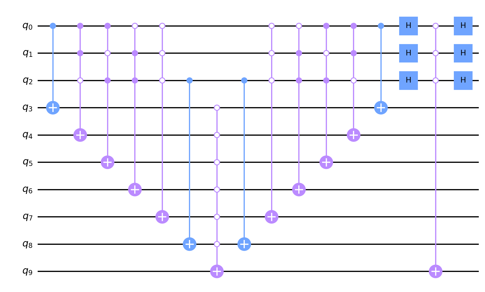

# q-solved (quantum, rev)

```
I copied the solver of a reversing task from the future. But it doesn't show the flag forever :thinking:
```

`solve.py`と`circuit.json`の2つのファイルが与えられる。`circuit.json`に量子回路とそのメタ情報が記録されており、`solve.py`はその量子回路を部分的に利用してフラグを求めるプログラムだとわかる。量子計算のライブラリはQiskitを使用している。

まず、どれくらいの規模の量子回路を扱うか確認すると、フラグ出力部分にあたる量子ビットの数が560、ancilla bitの数が1408、加えてもう一つ量子ビットを利用し、約2000量子ビットの量子回路を扱うことがわかった。

次に`solve.py`を実行すると、問題文で言及されてある通りフラグが表示されないことがわかる。具体的には、

```py
for i in range(round(0.785 * int(gmpy2.isqrt(2**nq)) - 0.5)):
    main.append(sub, [i for i in range(na + nq + 1)])
```

の`round(0.785 * int(gmpy2.isqrt(2**nq)) - 0.5)`が`1524995080397197381062058131273895481768403163579902233129876248135922221558175629312`という巨大な値になってしまい、ループが終わらなくなっている。やっている処理としては`sub`（`circuit.json`で定義されている量子回路）を`solve.py`で構築中の`main`回路にいくつも連結していくというもの。

とりあえずループ回数を適当に3回にしてループを終わるようにしてみると、回路シミュレーション部分で次のエラーが発生した。

```txt
qiskit.exceptions.QiskitError: 'ERROR:  [Experiment 0] Insufficient memory to run circuit circuit-0 using the statevector simulator. ,  ERROR: Insufficient memory to run circuit circuit-0 using the statevector simulator.'`
```
「状態ベクトルのシミュレーションに必要なメモリが足りない」というものだけどこれは当然で、2000近い量子ビット数の量子回路を従来のコンピュータでシミュレートできるわけがない（2^2000規模の計算資源が必要）。

具体的な量子回路の中身を見ていくことにし、`solve.py`を横目に`circuit.json`を眺めると、`circuit.json`に定義されているのは(multi-)controlled X gate群であることがわかり、それらゲートはフラグ部分にあたる量子ビットのいくつかをコントロールビットとしてancilla bitを操作していることもわかる。コントロールビット数は1か3のどちらかだが、このゲートを複数連ねることでフラグが出力されるような確率調整を行っていることが推測できる。さらに特徴的なのは、コントロールビット数が3のゲートに指定されるコントロールビットを`q_0`,`q_1`,`q_2`としたときに、`q_0`,`q_1`,`q_2`の出力がどうなりやすいかが1パターンか2パターンに絞れるようにゲートが十分用意されていることがわかる。例えば`(q_0,q_1,q_2)=(0,8,280)`の場合のゲートのみ取り出して図示してみると次のようになり、わかりやすい（`q_3`から`q_8`がancilla bit）。



上図の場合`(q_0,q_1,q_2)=(0,1,0)`の1パターンの確率が突出して高くなる。

ということで、量子回路をシミュレートせずとも`circuit.json`のcontrolled X gate群の定義だけから、各量子ビットが0と1のどちらになりやすいかが求まり、フラグ部分の量子ビットがどうなるかを計算可能。具体的には、確定した量子ビット情報をもとに、愚直にありえないパターンを削除していけば良い。量子ビット数が小さいからアルゴリズムはかなり雑なものでも高速。

`zer0pts{FLAG_by_Gr0v3r's_4lg0r1thm}`

---

ソルバーは以下。
```py
import json
from Crypto.Util.number import long_to_bytes

with open("circuit.json", "r") as f:
    circ = json.load(f)

nq = circ['memory']
circuit = circ['circuit']

ctrls = []
ls = []

result_bits = [None for _ in range(nq)]

for cs in circuit:
    ctrl = ''.join(['0' if x else '1' for (x, _) in cs])
    l = [c for (_, c) in cs]

    _v = list(zip(ctrl, l))
    _v.sort(key=lambda x: x[1])
    ctrl, l = zip(*_v)
    ctrl = "".join(ctrl)
    l = list(l)

    ctrls.append(ctrl)
    ls.append(l)

d = {}

for ctrl, l in zip(ctrls, ls):
    key = str(l)
    n = len(l)
    if key not in d:
        v = []
        for i in range(1 << n):
            v.append(bin(i)[2:].zfill(n))
        d[key] = v
    d[key].remove(ctrl)

for ctrl_1, l_1 in zip(ctrls, ls):
    n_1 = len(l_1)
    if n_1 != 1:
        continue
    for ctrl_2, l_2 in zip(ctrls, ls):
        n_2 = len(l_2)
        if n_2 != 3:
            continue
        if l_1[0] not in l_2:
            continue
        k = l_2.index(l_1[0])
        key = str(l_2)
        for i in range(1 << n_2):
            x = bin(i)[2:].zfill(n_2)
            if ctrl_1 == x[k] and x in d[key]:
                d[key].remove(x)

for key, item in d.items():
    l = list(map(int, key[1:-1].split(',')))
    n = len(item)

while None in result_bits:
    for key, item in d.items():
        l = map(int, key[1:-1].split(','))
        n = len(item)
        if n != 1:
            continue
        for i, c in zip(l, item[0]):
            result_bits[i] = int(c)

    for key, item in d.items():
        l = map(int, key[1:-1].split(','))
        n = len(item)
        if n == 1:
            continue
        for ctrl_i, i in enumerate(l):
            if result_bits[i] is None:
                continue
            for ctrl in item[::]:
                if int(ctrl[ctrl_i]) != result_bits[i]:
                    d[key].remove(ctrl)


def check_and_output_flag(x):
    if b"zer0pts" in x:
        print(x)


result = 0
for c in result_bits:
    result <<= 1
    result += c
result_r = 0
for c in result_bits[::-1]:
    result_r <<= 1
    result_r += c

for i in range(8):
    res = long_to_bytes(result << i)
    check_and_output_flag(res)
    check_and_output_flag(res[::-1])
    res = long_to_bytes(result_r << i)
    check_and_output_flag(res)
    check_and_output_flag(res[::-1])
```
